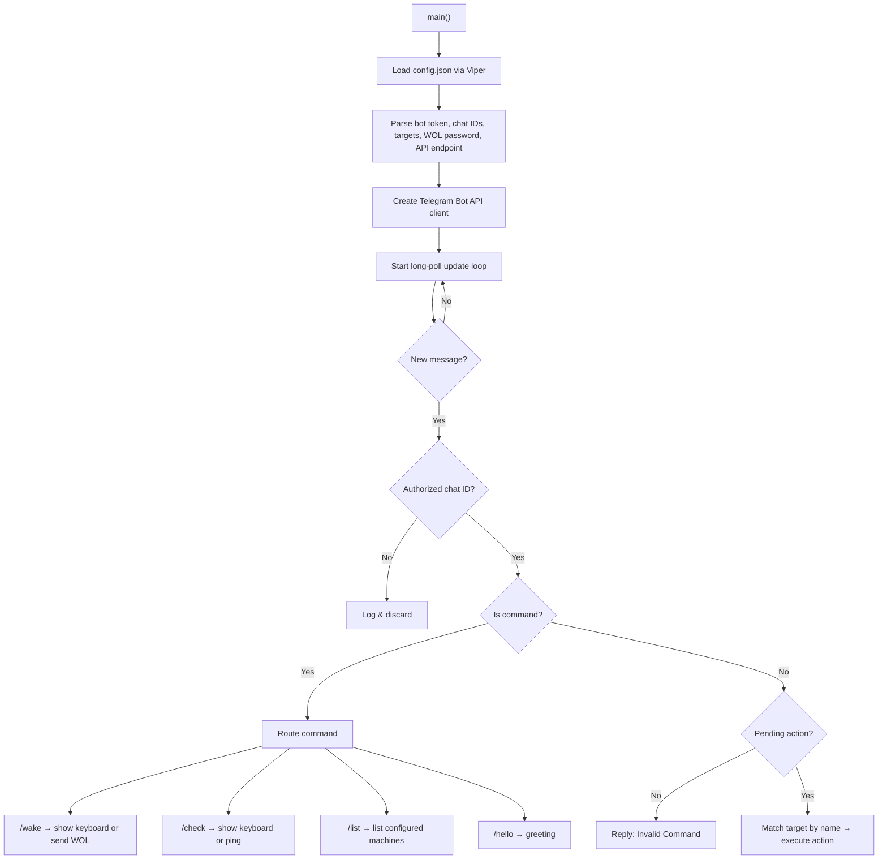
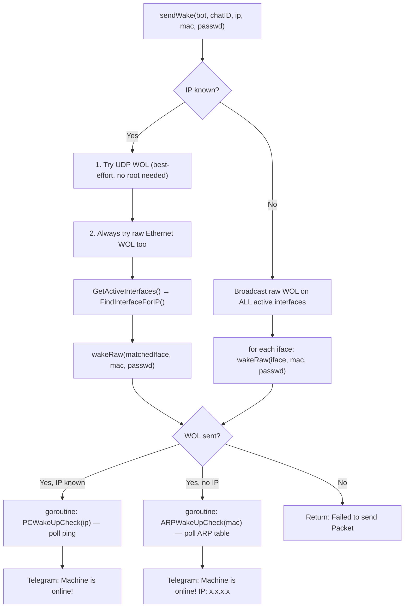
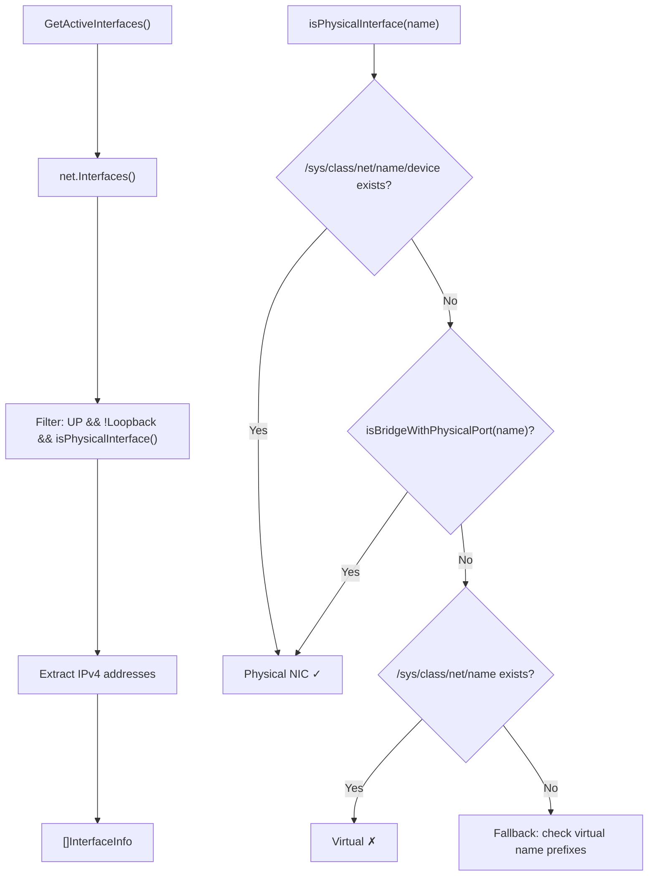

# `wakeup_go` — Codebase Walkthrough

## Overview

**wakeup_go** (module name: `wakebot_go`) is a **Telegram bot** that sends **Wake-on-LAN (WOL)** magic packets to remote machines. It runs as a long-lived service (typically via systemd as root), listens for Telegram commands, and wakes target PCs on the local network.

### Key Dependencies

| Dependency | Purpose |
|---|---|
| `github.com/go-telegram-bot-api/telegram-bot-api/v5` | Telegram Bot API client |
| `github.com/mdlayher/wol` | WOL magic packet construction & sending (UDP + raw Ethernet) |
| `github.com/spf13/viper` | Configuration file parsing (JSON) |

---

## File Structure

```
.
├── bot.go              # Entry point (main), Telegram command loop, wake orchestration
├── netutil.go          # Network interface discovery, subnet matching, ARP lookup
├── wol_client.go       # Thin wrappers around mdlayher/wol for UDP and raw WOL
├── bot_test.go         # Tests for PcPing
├── netutil_test.go     # Tests for interface discovery, subnet matching, broadcast, ARP
├── wol_client_test.go  # Tests for WOL send functions
├── config.json         # Runtime config (bot token, chat IDs, target machines)
├── Makefile            # Build/test/release targets
├── Dockerfile          # Multi-stage Docker build (scratch final image)
├── wakeup-go.service   # systemd unit file (runs as root for CAP_NET_RAW)
└── README.md           # User documentation
```

---

## Configuration ([config.json](file:///home/oem/code/go/wakeup_go/config.json))

```json
{
  "targets": [
    { "name": "SRV",     "mac": "00:25:90:03:FA:CD", "ip": "172.16.1.16:7" },
    { "name": "MINIWIN", "mac": "6C:4B:90:70:2C:34", "ip": "172.16.1.12:7" }
  ],
  "wol_passwd": "",
  "bot_token": "<telegram-token>",
  "chat_id": 515733796,
  "api_endpoint": ""
}
```

Two authorization models are supported:
- **Legacy**: Single `chat_id` (int)
- **Multi-user**: `chat_ids` (int array) — takes precedence when present

Two target models are supported:
- **Multi-target** (preferred): `targets` array with `name`, `mac`, `ip` per machine
- **Legacy single-target**: top-level `remote_ip` + `remote_mac`

---

## Execution Flow



---

## Core Components

### 1. `bot.go` — Entry Point & Telegram Command Loop

#### Data Structures

| Type | Purpose |
|---|---|
| [targetMachine](file:///home/oem/code/go/wakeup_go/bot.go#L15-L19) | Config struct: `Name`, `Mac`, `IP` for each WOL target |
| [pendingAction](file:///home/oem/code/go/wakeup_go/bot.go#L21-L28) | Enum (`idle`, `wake`, `ping`, `check`) tracking what the user is doing |
| [userInfo](file:///home/oem/code/go/wakeup_go/bot.go#L30-L37) | Per-user state: identity, their target list, and current pending action |

#### State Machine for Multi-Target Selection

When multiple targets are configured, `/wake` and `/check` use a **two-step interaction**:

1. **Command received** → Bot presents a Telegram `ReplyKeyboard` with target names → sets `pendingAction` to `wake` or `check`
2. **User taps a target name** (non-command message) → Bot matches the text against `targetMachine.Name` → executes the action → resets `pendingAction` to `idle`

If no targets are configured, it falls back to the legacy single `remote_ip`/`remote_mac`.

#### [sendWake()](file:///home/oem/code/go/wakeup_go/bot.go#L329-L429) — WOL Orchestration

This is the central wake function. It implements a **dual-path transmission strategy**:



**Key design decisions:**
- UDP WOL can silently fail when the target is off (ARP resolution fails for powered-down hosts), so raw Ethernet is always sent as a fallback
- When IP is unknown (DHCP targets), raw WOL is broadcast on **all** physical interfaces
- Post-wake monitoring runs in a **goroutine** so the user gets immediate "packet sent" feedback
- [ARPWakeUpCheck](file:///home/oem/code/go/wakeup_go/bot.go#L73-L98) uses broadcast pings to stimulate ARP table population (Linux doesn't add entries from Gratuitous ARP for unknown hosts)

#### Helper Functions

| Function | Purpose |
|---|---|
| [PcPing(ip)](file:///home/oem/code/go/wakeup_go/bot.go#L39-L52) | Shells out to `ping -c 1`, strips port if present |
| [PCWakeUpCheck(ip)](file:///home/oem/code/go/wakeup_go/bot.go#L54-L66) | Infinite ping loop (5s interval) until machine responds |
| [ARPWakeUpCheck(mac, ifaces, timeout)](file:///home/oem/code/go/wakeup_go/bot.go#L73-L98) | Polls `/proc/net/arp` with broadcast ping stimulation until MAC appears or timeout |

---

### 2. `netutil.go` — Network Interface Discovery & Utilities

This file provides Linux-aware network introspection.

#### Interface Discovery



**Bridge detection** ([isBridgeWithPhysicalPort](file:///home/oem/code/go/wakeup_go/netutil.go#L25-L48)): When a physical NIC (e.g. `eno1`) is enslaved under a Linux bridge (e.g. `br0`), the NIC loses its IP — the bridge holds it. Raw packets sent on the bridge are forwarded through the physical port. This function checks `/sys/class/net/<bridge>/brif/` for ports that have a `/sys/class/net/<port>/device` symlink (PCI/USB device backing).

#### Other Utilities

| Function | Location | Purpose |
|---|---|---|
| [FindInterfaceForIP](file:///home/oem/code/go/wakeup_go/netutil.go#L148-L174) | Finds which local interface's subnet contains a target IP. Handles `ip:port` format. |
| [BroadcastAddr](file:///home/oem/code/go/wakeup_go/netutil.go#L178-L189) | Calculates IPv4 broadcast address for a subnet (used for broadcast pings). |
| [LookupIPByMAC](file:///home/oem/code/go/wakeup_go/netutil.go#L199-L239) | Parses `/proc/net/arp` to find IP for a given MAC (only complete entries with flags `0x2`). |

---

### 3. `wol_client.go` — WOL Transmission

Two thin wrappers around `mdlayher/wol`:

| Function | Transport | Root Required | Description |
|---|---|---|---|
| [wakeUDP](file:///home/oem/code/go/wakeup_go/wol_client.go#L28-L42) | UDP socket | No | Sends WOL magic packet via UDP to `addr` (ip:port) |
| [wakeRaw](file:///home/oem/code/go/wakeup_go/wol_client.go#L9-L26) | Raw Ethernet | Yes (`CAP_NET_RAW`) | Sends WOL magic packet as raw Ethernet frame on a specific interface |

Both use `WakePassword()` — the password can be empty/nil for targets without WOL authentication.

---

## Deployment

- **systemd**: [wakeup-go.service](file:///home/oem/code/go/wakeup_go/wakeup-go.service) runs as `root` from `/opt/wakeup-go/`, auto-restarts on failure
- **Docker**: Multi-stage build producing a `scratch`-based image with a statically-linked binary
- **Build**: `make release` produces a fully static, stripped binary (`CGO_ENABLED=0`)

---

## Test Coverage

| File | Tests |
|---|---|
| [bot_test.go](file:///home/oem/code/go/wakeup_go/bot_test.go) | `PcPing` — localhost reachability, unreachable IPs, port stripping, invalid input |
| [netutil_test.go](file:///home/oem/code/go/wakeup_go/netutil_test.go) | Interface discovery, subnet matching, broadcast calculation, ARP lookup, bridge detection, virtual interface filtering |
| [wol_client_test.go](file:///home/oem/code/go/wakeup_go/wol_client_test.go) | Invalid addresses/interfaces, valid interface (skips if no CAP_NET_RAW), empty passwords |

> [!NOTE]
> Tests are mostly integration-style — they query the real system's interfaces and ARP table. Tests requiring `CAP_NET_RAW` gracefully skip when run as non-root.

---

## Notable Design Patterns

1. **Per-user state via `map[int64]*userInfo`** — Each Telegram user gets independent state (pending action, target list). Not mutex-protected since the update loop is single-goroutine.

2. **Dual-path WOL** — UDP first (works without root), then raw Ethernet (requires root but more reliable for powered-off targets that can't do ARP).

3. **Asynchronous post-wake monitoring** — `sendWake` returns immediately with "packet sent", then a goroutine polls for the machine coming online and sends a follow-up Telegram message.

4. **sysfs-based physical interface detection** — Avoids hardcoded interface names; works correctly with bridges, bonds, and arbitrary NIC naming schemes.
